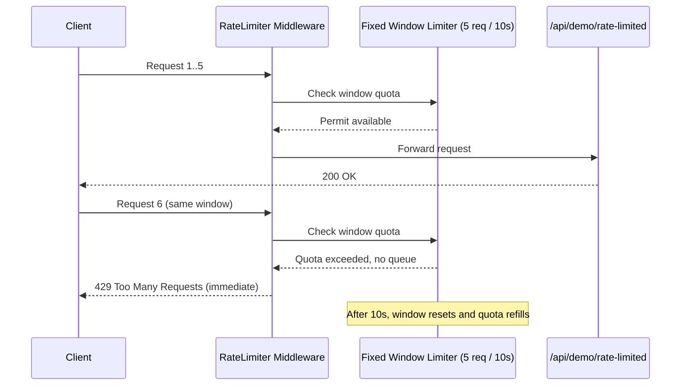
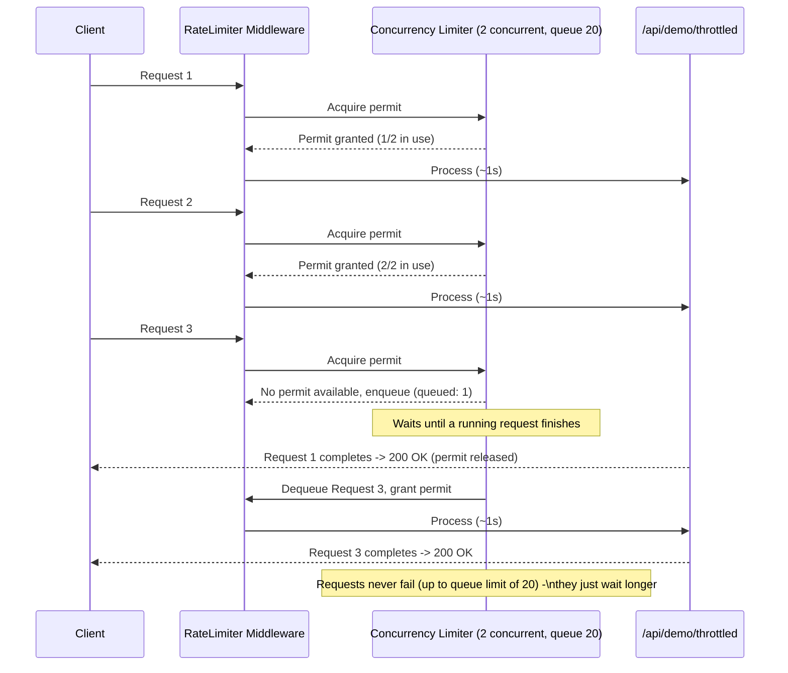
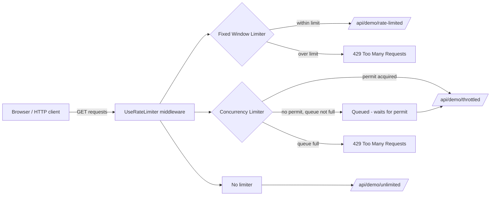

# Rate Limiting vs Throttling Demo

A small ASP.NET Core (.NET 10) Web API that demonstrates the practical difference between **rate limiting** and **throttling** using the built-in `Microsoft.AspNetCore.RateLimiting` middleware.

## Concepts

| | Rate Limiting | Throttling |
|---|---|---|
| Policy used | `AddFixedWindowLimiter` ("rate-limit-policy") | `AddConcurrencyLimiter` ("throttle-policy") |
| Behavior when over capacity | **Rejects** immediately with `429 Too Many Requests` | **Queues** the request and processes it later |
| Queue limit | `0` (no queue) | `20` |
| Limit type | Requests per time window (5 / 10s) | Concurrent requests being processed (2 at a time) |
| Client experience | Fast failure | Higher latency, but success |
| Typical use case | Protect against abuse/DoS, enforce quotas | Smooth out bursts, protect limited downstream resources (DB, external API) |

## Endpoints

| Endpoint | Policy | Description |
|---|---|---|
| `GET /api/demo/rate-limited` | `rate-limit-policy` | Allows 5 requests per 10-second window. The 6th+ request in the same window gets `429` instantly. |
| `GET /api/demo/throttled` | `throttle-policy` | Allows only 2 requests to execute concurrently (each takes ~1s of simulated work). Extra requests queue (up to 20) and wait their turn instead of failing. |
| `GET /api/demo/unlimited` | none (`[DisableRateLimiting]`) | Baseline endpoint with no limiting, for comparison. |

## Try it

1. Run the app (`F5` or `dotnet run`).
2. Open the root URL (`/`) in a browser — this serves `wwwroot/index.html`, a demo page with buttons.
3. Click **"Fire 10 requests at once"** under each endpoint and compare results:
   - **Rate Limited**: you'll see a mix of `200` and `429` responses, all returning almost instantly.
   - **Throttled**: all 10 requests eventually return `200`, but latency increases the further back in the queue a request is.
4. Alternatively, use `rate_limiting_vs_throttling.http` to fire requests manually and inspect responses.

## How it works

### Rate limiting flow (Fixed Window)

Requests beyond the permit limit within the current window are rejected outright — there is no queue, so the caller fails fast.



### Throttling flow (Concurrency Limiter with queue)

Requests beyond the concurrency limit are placed in a queue and processed as soon as a permit frees up, instead of being rejected.



### Architecture overview



## Project structure

```
rate_limiting_vs_throttling/
├── Program.cs                       # Rate limiter policy configuration
├── Controllers/
│   ├── DemoController.cs            # rate-limited / throttled / unlimited endpoints
│   └── WeatherForecastController.cs # default template sample
├── wwwroot/
│   └── index.html                   # Interactive demo page
└── rate_limiting_vs_throttling.http # Sample HTTP requests
```

## Key takeaway

- **Rate limiting** = a hard quota over time. Once exceeded, requests are rejected until the window resets. Best for enforcing usage quotas and blocking abuse.
- **Throttling** = a concurrency/flow-control mechanism. Excess requests are delayed (queued), not rejected, smoothing bursts so downstream resources aren't overwhelmed.
